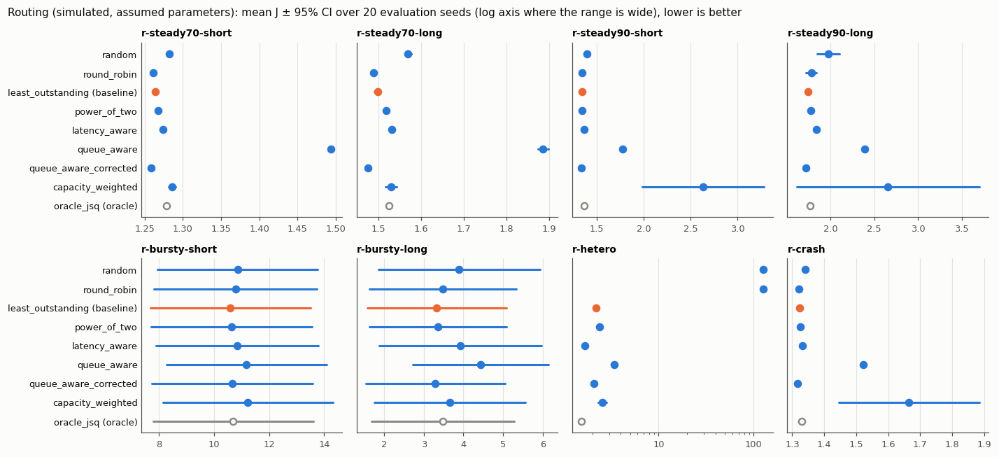
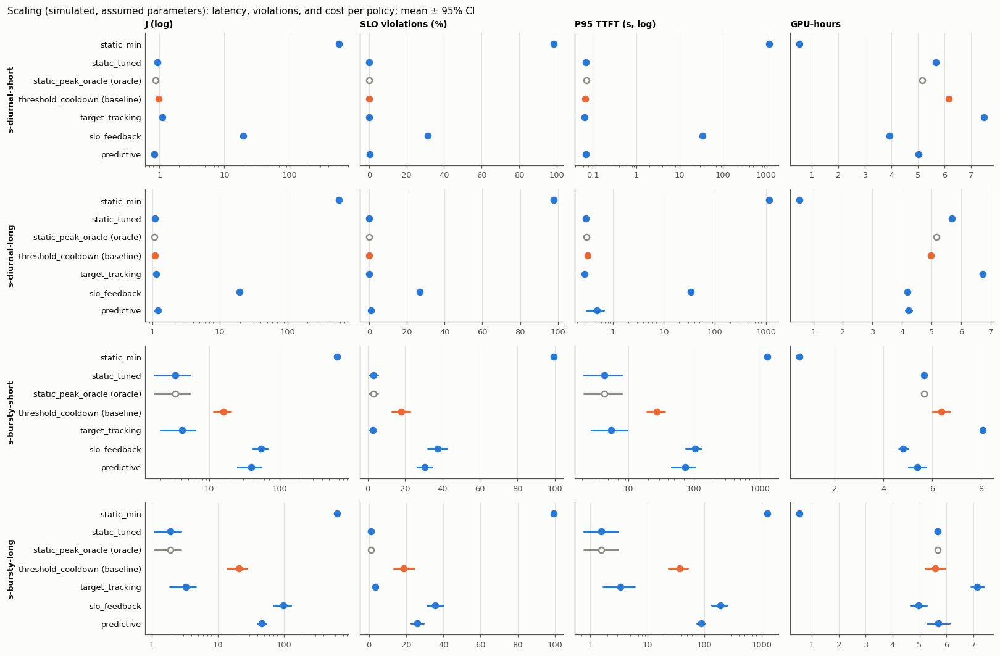

# LLM Serving Control Plane

A control plane for multi-model LLM serving: request routing, replica health, autoscaling, capacity allocation under a GPU budget, SLO control, and admission. Token generation stays in the serving backend. The policies are written once and run unchanged inside a deterministic discrete-event simulator of serving replicas, where they are compared fairly on replayed traffic.

> **Simulated results.** Every number and figure in this repository comes from a simulator with assumed parameters ([docs/simulator.md](docs/simulator.md)), not from real GPUs, vLLM, or SGLang. Read every result as "in this simulation, under these assumptions". Nothing here is a claim about production performance.

**Status:** benchmarked in simulation. The simulator, all policies, and the benchmark are implemented and tested; a live HTTP data plane runs the same policy code in front of mock backends (tests and an end-to-end demo). Nothing has been run against real GPUs, vLLM, or SGLang (see [TODO](#todo)).


## What is implemented

- **Traces:** schema v1 ([docs/contracts.md](docs/contracts.md)) with a validating loader and manifests; generators for Poisson, bursty (Markov-modulated on/off, gamma renewal), diurnal, and piecewise arrivals, short- and long-heavy length mixes with heavy output tails, SLO classes, and several models with shifting demand.
- **Simulator:** iteration-level continuous batching with chunked prefill, a KV-cache budget with preemption by recompute, replica lifecycle (provisioning, warm-up, ready, draining), stale scraped snapshots, crashes, GPU-hour accounting; five replica classes derived from GPU datasheet numbers with stated efficiency factors. Invariant tests and a Pollaczek-Khinchine closed-form check.
- **Routing:** `random`, `round_robin`, `least_outstanding`, `power_of_two`, `latency_aware` (peak EWMA), `queue_aware` (scraped queue depth and KV usage), `queue_aware_corrected` (the documented mitigation of stale-snapshot herding), `capacity_weighted` (smooth weighted round-robin from measured service rates), and `oracle_jsq` (true remaining work; an oracle for reference).
- **Health:** passive ejection after consecutive errors with doubling backoff and probation, active probes, bounded retries only before the first token.
- **Scaling:** `static`, `threshold_cooldown`, `target_tracking` (HPA-like stabilisation), `slo_feedback` (dead band, hysteresis, integral term), `predictive` (Holt forecast one warm-up ahead, Little's law); scale-in drains.
- **Capacity allocation:** `static_partition`, `proportional_demand`, `marginal_gain` (greedy by estimated violation reduction per GPU from an M/M/c approximation, with lookahead).
- **SLO control and admission:** per-class TTFT/TPOT/E2E targets, a sliding-window P95 error per model and replica feeding scaling, allocation, and routing weights; admission `none`, `queue_cap`, `predicted_ttft_shed` (sheds batch traffic first).
- **Benchmark:** frozen tuning on separate seeds with an equal search budget per policy, 20 evaluation seeds, 95 % confidence intervals, paired comparisons with win/tie/loss counts, oracle references, a sensitivity check, byte-identical reruns.
- **Live data plane:** an OpenAI-compatible proxy (`/v1/chat/completions`, `/v1/completions`) over the same dispatcher: server-sent-event pass-through, routing by `model`, active health probes and passive ejection, retries only before the first byte, upstream cancellation when the client disconnects, `429` with `Retry-After`, Prometheus `/metrics`, admin endpoints, an optional file-backed replica store; a mock backend that runs the simulator's engine in real time with vLLM-named metrics; a process executor that starts and stops mock backends for scale-out.
- **Backend adapters:** vLLM and SGLang metric mappings behind `backends.Scraper` (tolerant of missing and renamed metrics, a fuzzed text parser), checked against fixtures written from those projects' sources, never against a live server.
- **Public traces and prefix caching:** converters for the Azure LLM inference trace 2023 and BurstGPT; a per-replica prefix-cache model and a `prefix_affinity` router (consistent hashing with bounded loads).

## Results (simulated)

Protocol, scenarios, and the full per-metric tables: [benchmarks/README.md](benchmarks/README.md) and [docs/figures/results_table.md](docs/figures/results_table.md). Objective `J = P95(TTFT)/2 s + P95(TPOT)/100 ms + GPU-hours/(budget·duration) + 5·violation rate` for interactive traffic (batch: 20 s / 250 ms), lower is better; rejected, failed, timed-out, and unfinished requests count as violations.

<!-- results-summary:start -->
<!-- generated by scripts/plot_results.py from benchmarks/results; do not edit by hand -->
Mean J over 20 evaluation seeds (lower is better). ✓ / ✗ / = : better / worse / no difference than the family baseline (paired 95% interval of ΔJ). Oracles are references, not deployable. Simulated, assumed parameters.

**routing** (baseline `least_outstanding`)

| policy | r-steady70-short | r-steady70-long | r-steady90-short | r-steady90-long | r-bursty-short | r-bursty-long | r-hetero | r-crash |
|---|---|---|---|---|---|---|---|---|
| random | 1.282 ✗ | 1.569 ✗ | 1.393 ✗ | 1.974 ✗ | 10.863 ✗ | 3.889 ✗ | 126.6 ✗ | 1.340 ✗ |
| round_robin | 1.261 ✓ | 1.488 ✓ | 1.343 ✗ | 1.781 = | 10.790 ✗ | 3.478 ✗ | 126.6 ✗ | 1.320 ✓ |
| least_outstanding (baseline) | 1.264 | 1.497 | 1.341 | 1.745 | 10.600 | 3.329 | 2.190 | 1.323 |
| power_of_two | 1.267 ✗ | 1.518 ✗ | 1.345 ✗ | 1.770 ✗ | 10.638 = | 3.362 = | 2.365 ✗ | 1.325 ✗ |
| latency_aware | 1.274 ✗ | 1.531 ✗ | 1.364 ✗ | 1.840 ✗ | 10.843 ✗ | 3.923 ✗ | 1.658 ✓ | 1.332 ✗ |
| queue_aware | 1.494 ✗ | 1.886 ✗ | 1.771 ✗ | 2.391 ✗ | 11.182 ✗ | 4.436 ✗ | 3.430 ✗ | 1.522 ✗ |
| queue_aware_corrected | 1.258 ✓ | 1.475 ✓ | 1.334 ✓ | 1.720 ✓ | 10.659 ✗ | 3.295 = | 2.092 ✓ | 1.316 ✓ |
| capacity_weighted | 1.286 ✗ | 1.529 ✗ | 2.629 ✗ | 2.654 = | 11.230 ✗ | 3.658 ✗ | 2.561 ✗ | 1.664 ✗ |
| oracle_jsq (oracle) | 1.279 ✗ | 1.523 ✗ | 1.362 ✗ | 1.762 ✗ | 10.696 ✗ | 3.485 ✗ | 1.529 ✓ | 1.329 ✗ |

**scaling** (baseline `threshold_cooldown`)

| policy | s-diurnal-short | s-diurnal-long | s-bursty-short | s-bursty-long |
|---|---|---|---|---|
| static_min | 580.1 ✗ | 576.2 ✗ | 654.9 ✗ | 642.0 ✗ |
| static_tuned | 0.922 ✓ | 1.097 = | 3.257 ✓ | 1.905 ✓ |
| static_peak_oracle (oracle) | 0.878 ✓ | 1.080 ✓ | 3.257 ✓ | 1.905 ✓ |
| threshold_cooldown (baseline) | 0.967 | 1.106 | 15.713 | 20.867 |
| target_tracking | 1.099 ✗ | 1.144 ✗ | 4.111 ✓ | 3.243 ✓ |
| slo_feedback | 19.371 ✗ | 19.440 ✗ | 54.123 ✗ | 98.565 ✗ |
| predictive | 0.836 ✓ | 1.211 = | 39.224 ✗ | 46.621 ✗ |

**capacity** (baseline `static_partition`)

| policy | c-3model |
|---|---|
| static_partition (baseline) | 7.311 |
| proportional_demand | 5.072 ✓ |
| marginal_gain | 1.687 ✓ |

**overload** (baseline `none`)

| policy | o-overload |
|---|---|
| none (baseline) | 32.261 |
| queue_cap | 2.435 ✓ |
| predicted_ttft_shed | 2.361 ✓ |
<!-- results-summary:end -->

What the numbers say, in this simulation, under these assumptions:

- **Routing on identical replicas barely matters below saturation; stale signals hurt.** At 70–90 % load `least_outstanding`, `power_of_two`, `latency_aware`, `queue_aware_corrected`, and the oracle are within 2–7 % of each other in J (J includes the GPU term, which is a constant 1.0 for a static fleet, so latency differences look smaller in J than they are). `capacity_weighted` is unstable at 90 % load (J +97 % and +52 % over the baseline; in `r-steady90-long` it loses on 18 of 20 seeds, and the "=" verdict there comes from two outlier seeds widening the interval). `queue_aware`, which sees only scraped snapshots, herds requests onto the replica that looked emptiest and loses in all eight routing scenarios; adding router-local dispatches since the last scrape (`queue_aware_corrected`) removes the herding and makes it the best non-oracle router in six of eight scenarios, though by small margins (under 2 % in J). Some "better" verdicts are statistically clear but tiny: all 20 per-seed differences fall inside the 1 % tie band (see W/T/L in the full table).
- **Heterogeneous replicas punish load-blind routing.** With H100, A100, and V100 replicas, `random` and `round_robin` overload the slow V100s (J ≈ 127 against 2.19 for `least_outstanding`); `latency_aware` is the best deployable router there (1.66).
- **Routing cannot create capacity.** In `r-bursty-short` bursts reach about 140 % of capacity and every router ends with P95 TTFT around 15 s.
- **The oracle is not a bound on J.** `oracle_jsq` balances true remaining work, which ignores the batch composition that drives TPOT; it wins only on the heterogeneous cluster.
- **A well-chosen static fleet beats most autoscalers on this objective.** The static count tuned on the tuning seeds (11 replicas) has the lowest mean J among deployable scalers in three of four scaling scenarios (in `s-diurnal-long` not significantly different from `threshold_cooldown`, and in `s-bursty-short` not significantly different from `target_tracking`: paired ΔJ −0.85 ± 0.92), because J charges tail latency far more than GPU cost. `predictive` wins on the smooth diurnal short-heavy trace with less GPU time, but loses badly on bursts (its trend forecast lags step changes). The reference baseline `threshold_cooldown` is competitive on diurnal traffic but about 5× (short-heavy) and 11× (long-heavy) worse in J than the tuned static fleet on bursts. `target_tracking` handles bursts at the highest GPU cost. `slo_feedback` loses everywhere: P95 TTFT stays far below target until the queueing cliff, so a pure latency-error controller scales in until it crosses the cliff.
- **Allocation under a shared budget:** `marginal_gain` beats `proportional_demand`, which beats `static_partition` (one three-model scenario; `marginal_gain`'s inputs were corrected during development, see [benchmarks/README.md](benchmarks/README.md)).
- **Admission control is the difference between a usable and an unusable overload.** At 130 % load for five minutes, `queue_cap` and `predicted_ttft_shed` cut J from 32 to about 2.4 and violations from 60 % to 14–16 % (rejections included); the two are close, `predicted_ttft_shed` sheds batch traffic first.
- **Sensitivity:** the routing ranking survives a 0.25 s or 5 s scrape interval and a lighter output tail (Kendall τ ≥ 0.78; the warm-up variants cannot change a static fleet without crashes, so they are identical to the base runs); with a heavier tail τ drops to 0.5 and `least_outstanding` overtakes `queue_aware_corrected`. The scaling winner (`static_tuned`) survives every variant except the heavier tail, where `target_tracking` leads.





More figures: [capacity](docs/figures/capacity.png), [overload](docs/figures/overload.png), [sensitivity](docs/figures/sensitivity.png).

### Replayed public traffic (simulated backend)

Two committed excerpts of the Azure LLM inference trace 2023 (CC-BY 4.0, attribution in [configs/traces/README.md](configs/traces/README.md)) replayed against one simulated A100 and one simulated V100 replica with the frozen routing configurations. The traffic is real (timestamps and token counts); the backend is simulated. A fixed trace means deterministic routers have zero-width intervals (only the randomised routers vary with the seed), so even a 0.1 % difference is marked ✓ or ✗; the W/T/L column of the full table shows such cases as ties. Full table: [docs/figures/replay/results_table.md](docs/figures/replay/results_table.md).

<!-- replay-summary:start -->
<!-- generated by scripts/plot_results.py from benchmarks/results; do not edit by hand -->
Mean J over 20 evaluation seeds (lower is better). ✓ / ✗ / = : better / worse / no difference than the family baseline (paired 95% interval of ΔJ). Oracles are references, not deployable. Simulated, assumed parameters.

**routing** (baseline `least_outstanding`)

| policy | replay-azure-conv | replay-azure-code |
|---|---|---|
| random | 41.929 ✗ | 61.697 ✗ |
| round_robin | 40.230 ✗ | 63.123 ✗ |
| least_outstanding (baseline) | 3.418 | 37.637 |
| power_of_two | 3.524 ✗ | 38.457 ✗ |
| latency_aware | 2.741 ✓ | 31.921 ✓ |
| queue_aware | 2.741 ✓ | 40.810 ✗ |
| queue_aware_corrected | 2.477 ✓ | 37.681 ✗ |
| capacity_weighted | 2.912 ✓ | 33.872 ✓ |
| oracle_jsq (oracle) | 2.265 ✓ | 31.260 ✓ |
<!-- replay-summary:end -->

On the conversation excerpt, load-blind routers overload the V100 and every load-aware router does far better; on the coding excerpt, bursts of long prompts overload the pair for every router (about 90 % violations, P95 TPOT near 570 ms from prefill interference on the V100): no routing policy fixes missing capacity.

### Prefix caching

`configs/prefix.json`: four simulated H100 replicas, each with a prefix cache of 8 groups; 32 prefix groups shared by 90 % of requests (1024-token prefixes, prompts around 1.5k tokens), 90 % load. Tuned separately on the tuning seeds ([configs/tuned-prefix/](configs/tuned-prefix/)), evaluated on 20 seeds. Full table: [docs/figures/prefix/results_table.md](docs/figures/prefix/results_table.md).

<!-- prefix-summary:start -->
<!-- generated by scripts/plot_results.py from benchmarks/results; do not edit by hand -->
Mean J over 20 evaluation seeds (lower is better). ✓ / ✗ / = : better / worse / no difference than the family baseline (paired 95% interval of ΔJ). Oracles are references, not deployable. Simulated, assumed parameters.

**routing** (baseline `least_outstanding`)

| policy | p-prefix |
|---|---|
| round_robin | 1.437 ✓ |
| least_outstanding (baseline) | 1.444 |
| power_of_two | 1.455 ✗ |
| queue_aware_corrected | 1.430 ✓ |
| prefix_affinity | 1.352 ✓ |
<!-- prefix-summary:end -->

`prefix_affinity` keeps each group on one replica, so the caches hit and less prefill work interferes with decoding.

### Decision cost

<!-- decision-cost:start -->
<!-- generated by scripts/plot_results.py from benchmarks/results/microbench.txt; do not edit by hand -->
Time per routing decision in ns (`go test -bench`, real CPU time of the policy code; Intel Core i9-14900KF, Windows 11, go1.27.1; minimum of 5 runs, measured while unrelated jobs shared the machine). `Route`: the policy alone on a prepared view. `Dispatch`: the full dispatcher path (eligible-view construction from the registry, snapshot lookup, policy, completion).

| benchmark | policy | 8 replicas | 64 replicas | 512 replicas |
|---|---|---|---|---|
| Route | random | 8 | 7 | 8 |
| Route | round_robin | 23 | 25 | 22 |
| Route | least_outstanding | 11 | 78 | 569 |
| Route | power_of_two | 21 | 21 | 24 |
| Route | latency_aware | 242 | 1,958 | 20,096 |
| Route | queue_aware | 98 | 690 | 7,145 |
| Route | queue_aware_corrected | 96 | 857 | 6,812 |
| Route | capacity_weighted | 298 | 2,147 | 18,851 |
| Route | oracle_jsq | 54 | 674 | 4,754 |
| Route | prefix_affinity | 279 | 3,159 | 23,898 |
| Dispatch | least_outstanding | 1,757 | 18,034 | 148,123 |
| Dispatch | power_of_two | 1,877 | 16,952 | 152,528 |
| Dispatch | queue_aware_corrected | 2,063 | 17,217 | 177,167 |
| Dispatch | latency_aware | 1,982 | 17,257 | 180,638 |
<!-- decision-cost:end -->

## Build, test, run

Requires Go (the module says `go 1.23`; developed with go1.27.1) and, for figures only, Python 3 with matplotlib. The commands are the same in Windows PowerShell and in bash on Linux or macOS; run them from the repository root.

```bash
go build ./...
go vet ./...
go test ./...
go run ./cmd/benchmark -quick
```

Reproduce the evaluation (10 to 15 minutes each on the 32-thread desktop CPU named in the manifest, which other jobs were sharing: 14 min 18 s for tuning, 14 min 19 s and 9 min 59 s for two evaluation runs; the tuned configuration in `configs/tuned/` is committed, so the first command is only needed to regenerate it):

```bash
go run ./cmd/benchmark -tune
go run ./cmd/benchmark
python scripts/plot_results.py
python scripts/plot_framework.py
```

Replay and prefix experiments (seconds each; their tuned configurations are committed):

```bash
go run ./cmd/benchmark -config configs/replay.json -out benchmarks/results-replay
go run ./cmd/benchmark -config configs/prefix.json -tuned configs/tuned-prefix -out benchmarks/results-prefix
```

End-to-end live demo (builds the binaries, starts two mock backends and the control plane on 127.0.0.1:18080/18100/18101, streams a request, kills a backend, triggers a scale-out, shuts everything down; about a minute). Linux, macOS, or Git Bash:

```bash
bash scripts/demo.sh
```

Windows PowerShell:

```powershell
powershell -ExecutionPolicy Bypass -File scripts\demo.ps1
```

Decision-cost microbenchmarks, an in-process routing check, and trace tools:

```bash
go test -run NONE -bench . -benchmem ./internal/routing ./internal/controller
go run ./cmd/control-plane -config configs/example.json -once
go run ./cmd/tracegen -config configs/traces/sample.gen.json -seed 1 -out outputs/traces/sample.csv
```

CI (`.github/workflows/ci.yml`) runs build, vet, gofmt, `go test -race ./...`, and the quick benchmark. Scripts are always invoked through an interpreter (`bash scripts/demo.sh`, `python scripts/...`): the published repository does not keep executable bits, so on Linux and macOS either prefix shell scripts with `bash` as shown or run `chmod +x scripts/*.sh` once.

## Repository layout

```text
cmd/benchmark/        tuning, evaluation, statistics, result files
cmd/control-plane/    live control plane (proxy); -once routes one request in-process
cmd/mock-backend/     mock replica process
cmd/tracegen/         synthetic trace generator
cmd/traceconv/        public-trace converter (Azure 2023, BurstGPT)
internal/
  adapters/           Prometheus text parser, vLLM and SGLang mappings, scraper
  admission/          admission policies
  autoscaling/        scalers
  backends/           Backend and Scraper interfaces
  capacity/           allocators
  clock/ rng/         injected time, per-component random streams
  controller/         dispatcher, health, control loop, policy factory
  executor/           executor interface, process executor
  metrics/            snapshots, windows, records, run summary
  proxy/              live HTTP data plane
  registry/           replicas and classes
  routing/            routing policies
  sim/ sim/engine/    discrete-event simulator and replica engine
  sim/live/           mock backend (engine in real time)
  slo/                targets, attainment, SLO controller
  store/              replica persistence (memory, JSON file)
  trace/              trace schema v1 and converters
loadgen/              workload generators
configs/              classes, experiment, tuned configuration, sample trace
benchmarks/           protocol and committed results
docs/                 architecture, contracts, simulator, figures
deploy/               deployment notes
scripts/              figure and table scripts
```

## Stack

Go, standard library only (`net/http` for the data plane; the Prometheus text format is written and parsed by hand), Python 3 with matplotlib for figures, GitHub Actions CI. Planned, not present: gRPC admin API, PostgreSQL/Redis stores, Kubernetes executor, OpenTelemetry tracing, a run against real vLLM/SGLang servers.

## Documentation

- [docs/architecture.md](docs/architecture.md): modules, control loop, data flow, shared policy code, failure handling
- [docs/contracts.md](docs/contracts.md): trace schema v1, metric definitions, policy semantics (version 1, defined here; `gpu-cluster-scheduler` is expected to adopt it)
- [docs/simulator.md](docs/simulator.md): the simulator model, every assumption, derived class parameters, calibration protocol
- [benchmarks/README.md](benchmarks/README.md): protocol, scenarios, results, TODO
- [IMPLEMENTATION.md](IMPLEMENTATION.md): delivery checklist and checkpoint

## TODO

- Run the vLLM and SGLang adapters and the proxy against a real vLLM or SGLang server. So far the adapters have only been checked against fixtures and the proxy only against the mock backend, which emulates timing only, without warm-up delay.
- Calibrate the simulator against a real GPU and serving engine. The protocol is in [docs/simulator.md](docs/simulator.md) and has not been executed. Today the simulator uses datasheet numbers with assumed efficiency factors, a linear iteration-time model, token-granular KV, zero network latency, and one router.
- Kubernetes executor and manifests, gRPC admin API, PostgreSQL/Redis stores, OpenTelemetry tracing.
- A BurstGPT result table (the converter is tested; the replay table uses the Azure excerpts).
- More capacity and overload scenarios (one of each so far) and a wider tuning search (5 seeds and 12 configurations per policy so far).
- Check the rankings under other objective weights. Results depend on them, and J is dominated by tail-latency ratios when queues build; the per-metric tables show the trade-offs J hides.

## Reference projects

- [vllm-project/vllm](https://github.com/vllm-project/vllm) — high-throughput LLM serving backend
- [sgl-project/sglang](https://github.com/sgl-project/sglang) — LLM serving runtime and scheduling
- [ai-dynamo/dynamo](https://github.com/ai-dynamo/dynamo) — distributed LLM inference with KV-aware routing and autoscaling
- [kserve/kserve](https://github.com/kserve/kserve) — model-serving control-plane patterns on Kubernetes
- [ray-project/ray](https://github.com/ray-project/ray) — Ray Serve and distributed serving patterns

## License

MIT
