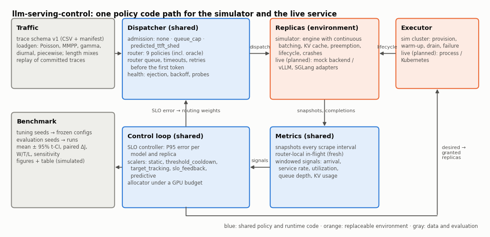

# Architecture

The control plane decides where each request goes and how many replicas each model gets. It never generates tokens. The same policy and runtime code runs inside the discrete-event simulator (where every benchmark number comes from) and in the live HTTP data plane in front of mock backends (exercised by tests and the demo scripts; never run against real vLLM or SGLang servers).

## Modules

| Package | Role | Depends on |
|---|---|---|
| `internal/clock` | injected time source: `Real` (monotonic) and `Fake` (tests, virtual time) | – |
| `internal/rng` | one deterministic `math/rand/v2` PCG stream per component, from (seed, name) | – |
| `internal/trace` | trace schema v1: reader with line-numbered errors, byte-stable writer, validator, manifest with SHA-256 | – |
| `loadgen` | workload generators (Poisson, MMPP on/off, gamma renewal, diurnal by thinning, piecewise; lognormal/Pareto lengths; SLO classes; prefix groups; several models) | trace, rng |
| `internal/registry` | replicas (model, class, lifecycle state, health, in-flight) and class priors; locked, sorted listings | – |
| `internal/metrics` | snapshots, windowed signals in bounded buckets, per-request records, run summary and `J`, ITL histogram | slo |
| `internal/slo` | targets per class, the attainment rule, the SLO controller (windowed P95 error per model and replica) | – |
| `internal/routing` | `Router` interface and ten policies (incl. `prefix_affinity`) | metrics, registry |
| `internal/admission` | admission interface and three policies | routing, slo |
| `internal/autoscaling` | `Scaler` interface and five policies | metrics |
| `internal/capacity` | `Allocator` interface and three policies | – |
| `internal/controller` | shared runtime: dispatcher (admission → routing → router queue → retries), health tracker, control loop (signals → SLO error → scalers → allocator → scale commands), policy factory | all policy packages |
| `internal/sim/engine` | one replica's scheduler: continuous batching, chunked prefill, KV capacity, preemption by recompute, optional prefix cache; driven by `Start`/`Finish`, no event loop | – |
| `internal/sim` | event loop, replica lifecycle, scrapes, probes, crashes, drain, GPU accounting, records; hardware classes from spec sheets; implements `executor.Executor` | controller, engine |
| `internal/sim/live` | mock backend: the engine driven by a real clock behind an OpenAI-compatible API, `/health`, vLLM-named `/metrics` | engine |
| `internal/proxy` | live data plane: OpenAI-compatible proxy over the dispatcher, SSE pass-through, retries before the first byte, cancellation, 429, probes, scraping, `/metrics`, admin API | controller, adapters, executor, store |
| `internal/executor` | `Executor` interface; `Process` starts and stops mock-backend processes | controller, registry |
| `internal/adapters` | Prometheus text parser (fuzzed), vLLM and SGLang metric mappings, HTTP scraper | metrics |
| `internal/backends` | `Backend` and `Scraper` interfaces | registry, metrics |
| `internal/store` | replica persistence: in-memory and JSON-file (atomic snapshot) | registry |
| `cmd/benchmark` | tuning, evaluation, statistics, result files | everything |
| `cmd/tracegen`, `cmd/traceconv` | synthetic traces; conversion of public traces (Azure 2023, BurstGPT) | loadgen, trace |
| `cmd/control-plane` | the live control plane (`-once`: route one request in-process) | proxy and everything it uses |
| `cmd/mock-backend` | one mock replica process | sim/live |

Policy, controller, and metrics packages import neither the simulator nor `net/http`, and never call `time.Now`: time arrives in views or through the clock.

## Control loop and data flow

1. **Arrival.** A request reaches the dispatcher. Admission decides admit / queue / reject from the eligible-replica view (rejections are violations).
2. **Routing.** The router picks one replica from the view: ready, healthy replicas of the model, each with router-local in-flight (fresh), dispatches since the last snapshot, the last scraped snapshot (stale), the class prior, and the replica's SLO error. With no eligible replica the request waits in the per-model FIFO router queue (timeout 60 s by default).
3. **Serving.** The replica engine batches the request. Errors before the first token are retried on another replica (at most two retries); after the first token they fail. Consecutive errors or failed probes eject a replica with exponential backoff; it returns on probation.
4. **Observation.** Every scrape interval each replica publishes a snapshot; completions and violations feed the windowed signals and the SLO controller.
5. **Control.** Every control interval (5 s) each model's scaler proposes a desired count; the allocator grants counts under the GPU budget (logging the reason when it grants less); the loop provisions replicas or drains them (fewest in-flight first). Draining replicas take no new traffic and finish their work within a grace period.

## How the simulator and the live service share the policy code

The dispatcher, health tracker, loop, and every policy are plain Go objects driven by method calls with explicit times (`Arrive(now, req)`, `Complete(now, id)`, `Snapshot(now, snap)`, `Tick(now)`, `Step(now)`). The simulator calls them at virtual times and executes the returned commands on simulated replicas. The live proxy (`internal/proxy`) calls the same methods at clock times, serialising them with one mutex (the dispatcher is single-threaded by design), forwards `Send` commands over HTTP, and hands scale commands to an `executor.Executor` (`executor.Process` starts mock-backend processes; `sim.Sim` is the simulated executor). The replica engine has no event loop of its own, so the mock backend (`internal/sim/live`) drives it with a real clock. One factory (`controller.NewRouter`, `NewScaler`, `NewAllocator`, `NewAdmission`) builds every policy from `{"name", "params"}` JSON for both paths. Oracle policies refuse to run live.

Live request path: client → proxy (admission, routing via the dispatcher) → replica; the client sees headers only after the first body byte arrives, so failures before it are retried on another replica; after it the stream is truncated. Active `/health` probes and passive error counting share the health tracker; `/metrics` of each replica is scraped (vLLM or SGLang names) into the same snapshots the simulator produces.

## Failure handling

| Failure | Detection | Reaction |
|---|---|---|
| replica crash | consecutive request errors, failed active probe, executor notice after a delay | ejection with backoff; retries before the first token; replacement by the control loop once the executor reports the failure |
| stale snapshots | – (inherent) | shown, not hidden: `queue_aware` herds; `queue_aware_corrected` is the documented mitigation |
| overload | admission policies, router-queue timeout | `queue_cap` bounds concurrency and queue; `predicted_ttft_shed` sheds batch traffic first |
| scale-in | – | drain with grace period; no request is dropped while the grace period lasts (tested) |
| request too long for the model | engine refuses | non-retryable failure |

## Determinism

Every run is single-threaded; randomness comes from named streams; ties break by replica ID; result rows are written in job order, so the benchmark's files are byte-identical for any number of workers (tested).
